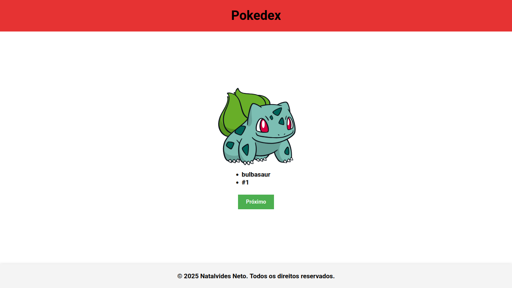

# Pokedex simples

## Descrição do Projeto
Sistema de Visualização de Pokémons

Este projeto é uma aplicação web interativa que simula uma Pokedex, permitindo aos usuários visualizar informações sobre diferentes Pokémon através da integração com a PokeAPI. O sistema inclui funcionalidades de reprodução de música temática e navegação sequencial pelos Pokémon disponíveis.

## Funcionalidades

✔ **Reprodução de música temática** com controles Play/Pause  
✔ **Integração com PokeAPI** para obtenção de dados em tempo real  
✔ **Visualização de informações** do Pokémon (nome, posição na Pokedex)  
✔ **Navegação sequencial** através dos Pokémon  
✔ **Design responsivo** com transições suaves  
✔ **Limite inteligente** de 1302 Pokémon (ciclo contínuo)

## Objetivo

Demonstrar conceitos fundamentais de desenvolvimento web front-end, incluindo:

- **Estruturação semântica** com HTML5
- **Estilização avançada** com CSS3 (Grid, Flexbox, transições)
- **Manipulação do DOM** com JavaScript
- **Consumo de API REST** com Fetch API
- **Tratamento de promessas** e erros
- **Event handling** para interatividade
- **Design responsivo** para múltiplos dispositivos

## Tecnologias Utilizadas

- **Frontend:** HTML5, CSS3, JavaScript (ES6+)
- **API Externa:** PokeAPI (https://pokeapi.co/)
- **Recursos:** Sprites oficiais dos Pokémon, música temática
- **Layout:** CSS Grid e Flexbox para estruturação responsiva

## Características Técnicas

- **Arquitetura:** Client-side rendering
- **Armazenamento:** Estado local (contador de Pokémon)
- **Navegação:** Sistema cíclico (reinicia após o Pokémon #1302)
- **UX/UI:** Feedback visual através de hover effects e transições
- **Performance:** Carregamento sob demanda dos dados dos Pokémon

## Saída

Interface web responsiva com exibição visual dos Pokémon e suas informações

Este projeto é ideal para desenvolvedores iniciantes em JavaScript, demonstrando integração com APIs externas, manipulação assíncrona de dados e criação de interfaces interativas com feedback visual imediato.

## Como Executar

1. Clone o repositório
2. Abra o arquivo `index.html` em seu navegador
3. Clique no botão "Play" para iniciar a música temática
4. Use o botão "Próximo" para navegar entre os Pokémon

## Desenvolvido por
Natalvides Neto - 2025