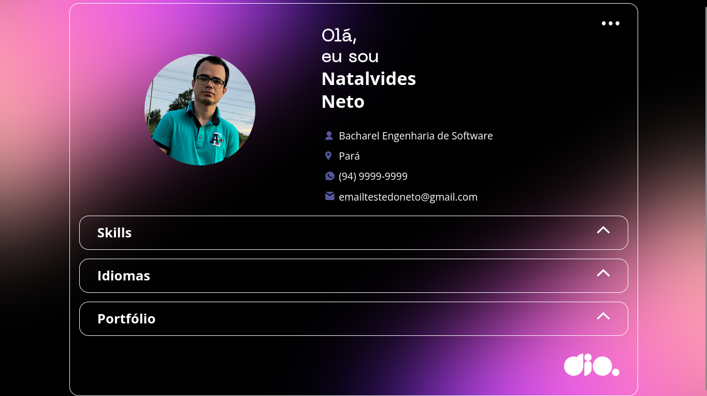

# Portfólio Profissional - Natalvides Neto



## 📋 Descrição do Projeto
**Portfólio Profissional Dinâmico**

Este projeto é um portfólio profissional interativo desenvolvido com tecnologias web modernas, apresentando informações pessoais, habilidades, idiomas e projetos de forma dinâmica através da integração com uma API JSON personalizada. O sistema inclui seções expansíveis (acordeão) e design responsivo para uma experiência de usuário otimizada.

## ✨ Funcionalidades

✔ **Carregamento dinâmico de dados** via API JSON personalizada  
✔ **Sistema de acordeão interativo** para organização de conteúdo  
✔ **Design responsivo** adaptável a diferentes dispositivos  
✔ **Integração de informações profissionais** atualizáveis remotamente  
✔ **Navegação intuitiva** com feedback visual  
✔ **Links de contato diretos** (email e telefone)  

## 🎯 Objetivo

Demonstrar habilidades em desenvolvimento web front-end e criar uma presença digital profissional, incluindo:

- **Estrutura semântica** com HTML5
- **Estilização avançada** com CSS3 (Grid, Flexbox, animações)
- **Manipulação dinâmica do DOM** com JavaScript
- **Consumo de API REST** com Fetch API
- **Tratamento assíncrono** de dados
- **Design de interface moderna** com transições suaves
- **Otimização para SEO** e acessibilidade

## 🛠 Tecnologias Utilizadas

- **Frontend:** HTML5, CSS3, JavaScript (ES6+)
- **API Externa:** JSON personalizado hospedado no GitHub
- **Fontes:** Open Sans, Neue Machina
- **Layout:** CSS Grid e Flexbox para estruturação responsiva
- **Ícones:** SVG customizados
- **Normalização:** Normalize.css

## 🔧 Características Técnicas

- **Arquitetura:** Single Page Application (SPA)
- **Dados Dinâmicos:** Carregamento via fetch API
- **Interatividade:** Sistema de acordeão com transições CSS
- **Performance:** Carregamento assíncrono de dados
- **UX/UI:** Hover effects, transições suaves e feedback visual
- **Responsividade:** Design adaptativo para mobile e desktop

## 📁 Estrutura do Projeto

```
├── index.html
├── assets/
│   ├── css/
│   │   ├── global.css
│   │   ├── header.css
│   │   ├── acordeon.css
│   │   ├── skills.css
│   │   ├── languages.css
│   │   ├── portfolio.css
│   │   └── footer.css
│   ├── js/
│   │   ├── main.js
│   │   ├── api.js
│   │   └── acordeon.js
│   ├── img/
│   │   ├── icons/
│   │   └── background.svg
│   └── fonts/
└── data/
    └── profile.json
```

## 📊 Seções do Portfólio

- **👤 Perfil Pessoal:** Foto, nome, cargo, localização e informações de contato
- **💻 Habilidades Técnicas:** Ferramentas e tecnologias dominadas
- **🤝 Habilidades Pessoais:** Competências comportamentais
- **🌐 Idiomas:** Línguas faladas
- **📂 Portfólio:** Projetos desenvolvidos com links
- **💼 Experiência Profissional:** Trajetória profissional

## 🎨 Como Personalizar

1. **Atualize o arquivo JSON** (`profile.json`) com suas informações
2. **Modifique as cores** nos arquivos CSS para combinar com sua identidade visual
3. **Adicione novas seções** seguindo o padrão de acordeão existente
4. **Atualize as imagens** na pasta `assets/img/`
5. **Ajuste as fontes** conforme sua preferência

## 🚀 Como Executar

1. Clone o repositório
2. Abra o arquivo `index.html` em seu navegador
3. As informações serão carregadas automaticamente da API
4. Clique nas seções para expandir/contrair o conteúdo

## 👨‍💻 Desenvolvido por
**Natalvides Neto** - 2025

---

> **Nota:** Este projeto faz parte do desafio da Digital Innovation One (DIO) para criação de portfólios profissionais dinâmicos, demonstrando competências em desenvolvimento front-end e integração com APIs.

<!--## 🔗 Links Úteis

- [🌐 Visualizar Portfólio Online]()
- [💻 Repositório no GitHub]()
- [📧 Entrar em Contato](mailto:emailtestedoneto@gmail.com)-->

---

*Última atualização: 30 de Setembro de 2025*